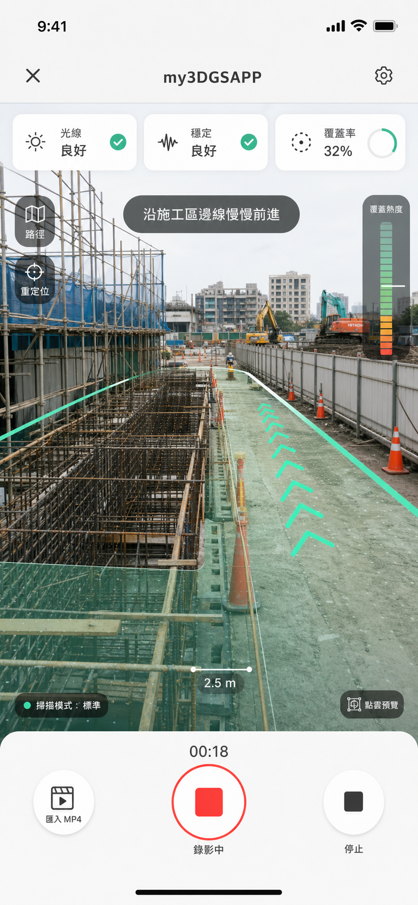

# APP-A4: my3DGSAPP Construction Capture Guidance Design

日期：2026-06-29

## 目標

APP-A4 把手機錄影頁從「選 MP4」提升成「工地範圍掃描導引」。

v0.1 服務的主要場景是施工現場，不是單一桌上模型。App 要引導使用者沿著施工區域移動、補拍高低角度、避免太快或太暗，最後產生一支可上傳到 QA pipeline 的 MP4。

## 視覺方向

參考概念圖：



方向：

- 亮色工程工具感，不再整體黑暗。
- 主畫面以相機預覽為主，中心不放大面積卡片。
- 使用安全橘、測量綠/青色、石墨黑、淺灰白作為主色。
- 疊加工地範圍邊線、前進箭頭、覆蓋率條、距離/路徑提示。
- UI 文字全中文，語氣像現場測量工具，不像消費級自拍 App。

## 拍攝導引

v0.1 先做泛用工地導引，不分室內/戶外、不做 AI 取景判斷。

導引提示循環：

1. `沿施工區邊線慢慢前進`
2. `鏡頭往右補拍`
3. `抬高鏡頭拍上方結構`
4. `壓低鏡頭拍地面與管線`
5. `放慢速度，保持畫面穩定`
6. `補拍陰影與遮蔽區`
7. `保持每段畫面重疊`

狀態 chips：

- `光線良好` / `光線不足`
- `穩定良好` / `移動太快`
- `覆蓋率 32%`

v0.1 的覆蓋率是 UI heuristic，不代表真實 3D 覆蓋率；先用錄影時間與提示進度估算。後續可接 server QA / preflight 再變成真指標。

## 錄影流程

```text
Capture Page
  -> 啟動錄影
  -> 開相機預覽
  -> 顯示中文導引 HUD
  -> 停止錄影
  -> Capture Review
  -> 確認上傳
```

按鈕：

- `啟動錄影`
- `停止`
- `重新拍攝`
- `匯入 MP4`
- `下一步上傳`

`匯入 MP4` 保留為備援；如果 WebView 相機或 MediaRecorder 不支援，使用者仍可用系統相機錄完再匯入。

## 技術方案

v0.1 採 WebView 內錄影：

- `navigator.mediaDevices.getUserMedia({ video: { facingMode: "environment" }, audio: false })`
- `MediaRecorder` 錄影
- Android 加 `CAMERA` permission
- 錄完取得 `Blob` 與 object URL，先給 Capture Review 使用

不做：

- native CameraX plugin
- 背景錄影
- 真 AR tracking
- 真-time blur/light CV 分析
- 手機端 3DGS / OpenMVS

## Metadata

APP-A4 補充 `capture_metadata.json`：

```json
{
  "capture": {
    "scene_type": "construction_site",
    "guidance_profile": "construction_range_v0",
    "media_type": "video",
    "mode": "qa"
  },
  "quality_hints": {
    "low_light_warning": false,
    "motion_too_fast_warning": false,
    "too_short_warning": false,
    "coverage_hint": "estimated"
  },
  "guidance_events": [
    {
      "at_sec": 4,
      "message": "沿施工區邊線慢慢前進"
    }
  ]
}
```

Metadata 仍只做 sidecar 保存與後續分析，不影響 v0.1 worker 決策。

## 錯誤處理

- 沒有相機權限：顯示 `無法啟動相機，請開啟權限或改用匯入 MP4`。
- WebView 不支援 MediaRecorder：顯示 `此裝置不支援 App 內錄影，請使用匯入 MP4`。
- 錄影時間太短：提示 `建議至少 20 秒，請重新拍攝或仍然上傳測試`。
- 錄影中斷：保留已錄片段，允許重新拍攝。

## 驗收

- 手機 Capture Page 可點 `啟動錄影`。
- 錄影中看到中文工地導引 HUD。
- 可停止錄影並看到影片預覽。
- 保留 `匯入 MP4` 備援。
- Android manifest 含 CAMERA permission。
- `npm run build` 通過。
- `run_android.bat` 可部署到已連接 Android 手機。

## Skipped

APP-A4 不做：

- AI 自動判斷構圖
- 真覆蓋率計算
- ARKit / ARCore pose stream
- native CameraX plugin
- background recording
- upload API 實作
- server placement 編輯器
